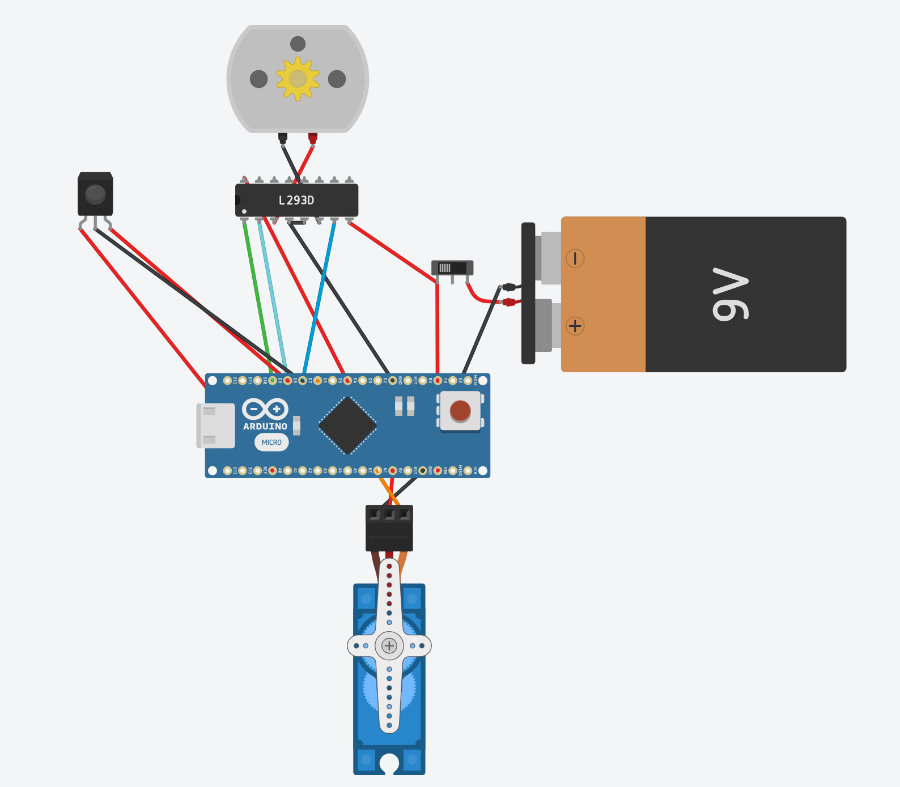
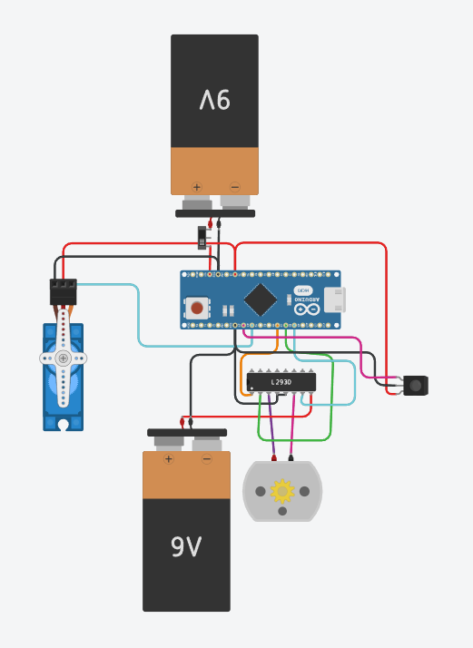
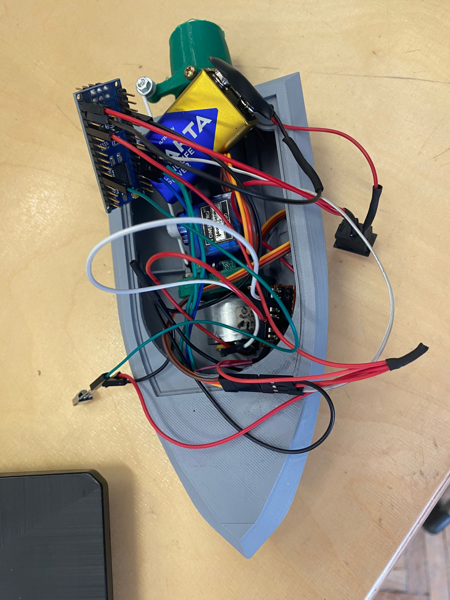
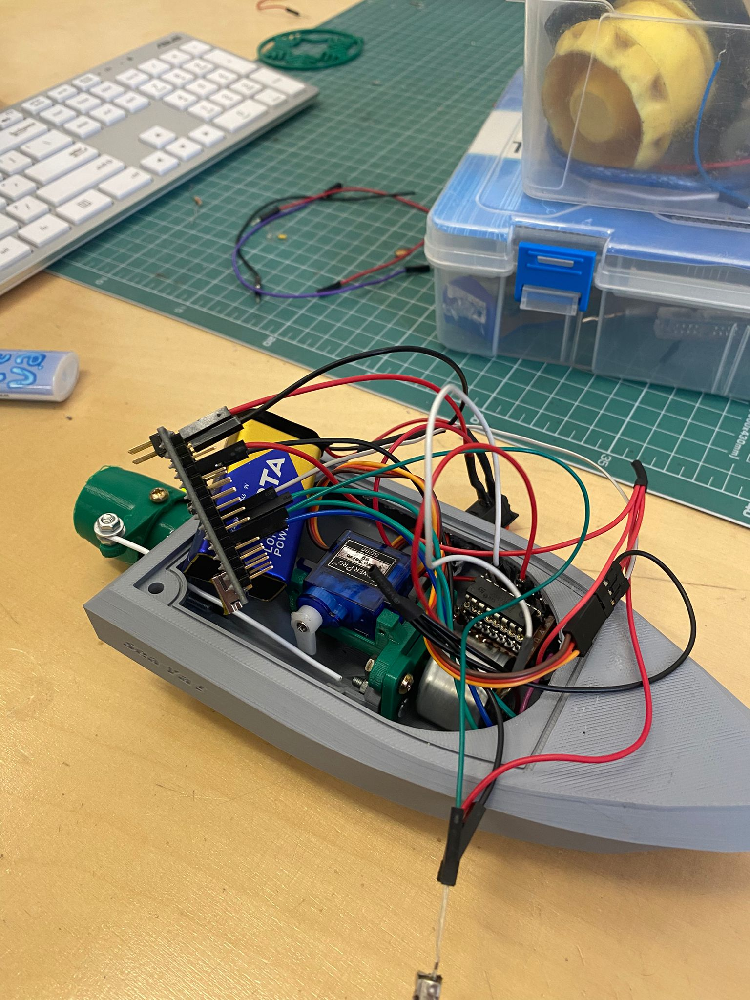

# Remote-Controlled Boat

## Table of Contents
- [Introduction](#introduction)
- [Hardware Components](#hardware-components)
- [Software Components](#software-components)
- [Functional Description](#functional-description)
- [Operation Modes](#operation-modes)
- [Implementation Details](#implementation-details)
- [Software Implementation](#software-implementation)
- [Sensor Calibration](#sensor-calibration)
- [Experimental Results](#experimental-results)
- [Conclusions and Future Work](#conclusions-and-future-work)
- [Appendix](#appendix)
- [References](#references)

---

## Introduction

This project showcases a remote-controlled boat powered by two approximately 8V power supplies. The boat utilizes an infrared sensor for remote communication, allowing seamless control over its movement. A DC motor, managed via an L293D motor shield, propels the boat, while a servo motor enables precise steering. The system is designed for simplicity and efficiency, making it an excellent demonstration of integrating basic components to achieve functional remote-controlled navigation. This project serves as a foundation for exploring advanced control mechanisms and alternative power solutions in future iterations. The boat design was inspired by a 3D-printed model available at [Cults3D](https://cults3d.com/en/3d-model/gadget/3d-printed-rc-brushed-jet-propulsion-boat-jet-boat-max_imagination).

---

## Hardware Components

| **Component**         | **Quantity** | **Role**                             | **Datasheet/Link**        |
|------------------------|--------------|--------------------------------------|---------------------------|
| Arduino Nano           | 1            | Main microcontroller                 | [Arduino Nano](https://docs.arduino.cc/hardware/nano) |
| L293D Motor Driver     | 1            | Controls the DC motor                | [L293D Datasheet](https://www.ti.com/lit/ds/symlink/l293.pdf) |
| Infrared Sensor        | 1            | Captures remote input                | [IR Sensor Datasheet](https://components101.com/sensors/ir-sensor-module) |
| DC Motor (FF-180)      | 1            | Provides forward propulsion          | [FF-180 Datasheet](https://www.nbleisonmotor.com/FF-180-Dc-Micro-Motor-pd6293204.html) |
| Servo Motor (SG90)     | 1            | Enables steering                     | [SG90 Datasheet](https://servodatabase.com/servo/towerpro/sg90) |
| 8V Battery (Arduino)   | 1            | Powers the Arduino                   | N/A                      |
| 8V Battery (Motor)     | 1            | Powers the motor driver              | N/A                      |
| Power Switch           | 1            | Turns the system ON/OFF              | N/A                      |
| Wires and Connectors   | Multiple     | Connects components                  | N/A                      |

---

## Software Components

- **PlatformIO**: Used for programming the Arduino Nano.
- **Libraries**:
  - **IRremote**: For decoding infrared signals sent by the remote.
  - **Servo**: For adjusting the position of the servo motor.

---

## Functional Description

The remote-controlled boat operates as follows:

1. **Infrared Sensor**: Captures signals from a remote control and sends them to the Arduino Nano via **D2**.
2. **L293D Motor Driver**: Manages the DC motor for propulsion:
   - **Control Pin 1**: Connected to **D6** for motor control.
   - **Input 1**: Connected to **D7** for motor direction.
   - **Input 2**: Connected to **D8** for motor direction.
3. **Servo Motor (SG90)**: Connected to **D3** for steering the boat.
4. **Power Supply**: Two 8V batteries are used; one powers the Arduino Nano through **Vin** and **GND**, and the other powers the motor driver through **VccMotor** and connects only to the Arduino's ground.

---

## Operation Modes

1. **Forward Movement**: The Arduino Nano controls the DC motor using the L293D driver.
2. **Steering**: The SG90 servo motor rotates to adjust the boat’s direction based on input from the infrared sensor.
3. **Power Control**: A switch is used to turn the entire system ON or OFF.

---

## Implementation Details

### Pin Connections

| **Component**          | **Pin**     | **Arduino Pin** | **Purpose**                      |
|-------------------------|-------------|-----------------|----------------------------------|
| Power Supply (Arduino)  | Vin         | Vin             | Main power input for Arduino     |
| Power Supply (Motor)    | VccMotor    | VccMotor        | Main power input for motor driver|
| L293D Motor Driver      | Control 1   | D6              | Motor control signal             |
|                         | Input 1     | D7              | Motor direction input            |
|                         | Input 2     | D8              | Motor direction input            |
|                         | Output 1    | DC Motor +      | Motor connection                 |
|                         | Output 2    | DC Motor -      | Motor connection                 |
| Servo Motor (SG90)      | VCC         | 5V              | Power input                      |
|                         | Signal      | D3              | Steering control signal          |
| Infrared Sensor         | VCC         | 5V              | Power input                      |
|                         | Output      | D2              | Signal input to Arduino          |
| Switch                  | Positive    | Power Supply    | System ON/OFF control            |

### Block Diagram

The block diagram illustrates how each component is interconnected:

- **Old Block Diagram**:  
  

- **New Block Diagram**:  
  

### Electrical Diagram

The electrical schematic details the wiring setup:

- **Old Circuit Diagram**:  
  

- **New Circuit Diagram**:  
  

---

## Software Implementation

The software implementation is crucial for the boat's operation, utilizing the Arduino Nano to interpret signals and control components. Key functions include:

- **toggleMotor()**: This function toggles the motor's state between ON and OFF. When turned on, it sets the motor speed to 50% and defaults the direction to forward.
- **increaseSpeed()** and **decreaseSpeed()**: These functions adjust the motor speed incrementally, ensuring smooth acceleration and deceleration.
- **switchDirection()**: This function changes the motor's direction, resetting the speed to 50% to ensure stability during direction changes.
- **moveServoLeft()** and **moveServoRight()**: These functions adjust the servo motor's position, allowing precise control over the boat's steering.

---

## Sensor Calibration

To calibrate the sensor elements, I conducted tests to determine the specific infrared codes emitted by each button on the remote control. By capturing these codes, I was able to adjust the software to call different functions based on the received signals. This calibration process ensured that each button on the remote correctly triggered the intended action, such as toggling the motor, adjusting speed, or steering the boat.

---

## Experimental Results

Following the hardware implementation, it was observed that the initial motor lacked sufficient power for optimal performance. Consequently, a more robust motor was installed, necessitating an additional power supply dedicated solely to the motor. This enhancement significantly improved the boat's propulsion capabilities, ensuring reliable and efficient operation.

---

## Conclusions and Future Work

With the addition of two power supplies and a larger motor, the boat has become too heavy to float effectively. Future work should focus on modifying the hull to accommodate the increased weight. This could involve either designing a larger hull to house all the power supplies or enhancing the current hull's buoyancy. One potential solution is to attach polystyrene to the sides of the boat to prevent it from sinking.

---

## Appendix

### Hardware Assembly Photos

1. **Old Hardware Setup - Full View**  
   
   
2. **New Hardware Setup - Full View**  
   

3. **Old Close-up of Key Connections**  
   

4. **New Close-up of Key Connections**  
   

---

## References

- [Arduino Nano Documentation](https://docs.arduino.cc/hardware/nano)
- [L293D Datasheet](https://www.ti.com/lit/ds/symlink/l293.pdf)
- [IR Sensor Module](https://components101.com/sensors/ir-sensor-module)
- [FF-180 DC Motor Datasheet](https://www.nbleisonmotor.com/FF-180-Dc-Micro-Motor-pd6293204.html)
- [SG90 Servo Motor Datasheet](https://servodatabase.com/servo/towerpro/sg90)
- [3D Printed Boat Design](https://cults3d.com/en/3d-model/gadget/3d-printed-rc-brushed-jet-propulsion-boat-jet-boat-max_imagination)
